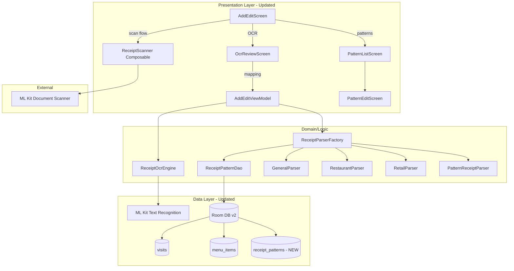
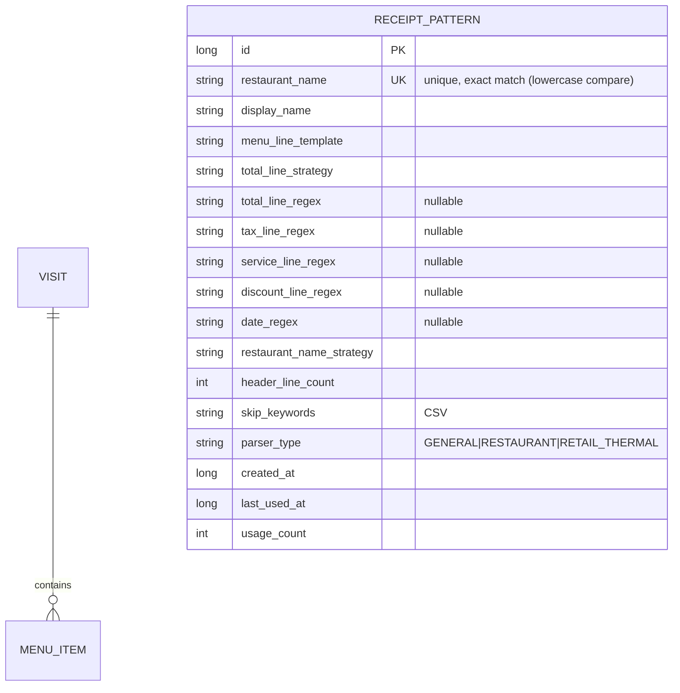

# Architecture — Fitur Scan Struk

> Dokumen ini adalah **add-on** dari `architecture.md` utama. Berisi informasi teknis (arsitektur, package, data model, dependency) khusus untuk fitur Scan Struk.

---

## 1. Ikhtisar Arsitektur

Fitur Scan Struk menambahkan 4 subsistem baru ke arsitektur MVVM yang sudah ada:



### Prinsip Tambahan
1. **Pipeline Processing**: Scan → OCR → Mapping → Pattern Lookup — berjalan berurutan, setiap tahap bisa diulang manual oleh user.
2. **Graceful Degradation**: Jika ML Kit (Document Scanner) tidak tersedia (device tanpa GMS), fallback ke kamera existing.
3. **Template-Driven Pattern**: Pattern disimpan sebagai template visual (bukan raw regex) agar user-friendly; template di-convert ke regex saat runtime.

---

## 2. Dependency Baru

### 2.1. ML Kit Libraries

```toml
# libs.versions.toml — additions
mlkit-document-scanner = "16.0.0-beta1"
mlkit-text-recognition-latin = "16.0.0.1"
coroutines-play-services = "1.8.1"

# library declarations
androidx-mlkit-document-scanner = { group = "com.google.mlkit", name = "document-scanner", version.ref = "mlkit-document-scanner" }
androidx-mlkit-text-recognition-latin = { group = "com.google.mlkit", name = "text-recognition-latin", version.ref = "mlkit-text-recognition-latin" }
kotlinx-coroutines-play-services = { group = "org.jetbrains.kotlinx", name = "kotlinx-coroutines-play-services", version.ref = "coroutines-play-services" }
```

### 2.2. app/build.gradle.kts — additions
```kotlin
dependencies {
    // ... existing ...
    implementation(libs.androidx.mlkit.document.scanner)
    implementation(libs.androidx.mlkit.text.recognition.latin)
    implementation(libs.kotlinx.coroutines.play.services)
}
```

### 2.3. Constraint
- **ML Kit Document Scanner** butuh Google Play Services. Check via `GoogleApiAvailability` sebelum launch. Fallback ke Camera biasa jika tidak tersedia.
- **ML Kit Text Recognition Latin** sudah bundled (offline), tidak butuh GMS untuk runtime.

---

## 3. Package Structure (Updated)

```
com.pndnwngi.billumaba/
│
├── data/
│   ├── database/
│   │   ├── AppDatabase.kt              ← MODIFIED: version 2, +ReceiptPatternEntity
│   │   ├── Migrations.kt               ← NEW: MIGRATION_1_2
│   │   ├── dao/
│   │   │   └── ReceiptPatternDao.kt    ← NEW
│   │   └── entities/
│   │       └── ReceiptPatternEntity.kt ← NEW
│   │
│   ├── ocr/                            ← NEW (TAHAP 2)
│   │   ├── OcrModels.kt                ← OcrResult, OcrLine
│   │   └── ReceiptOcrEngine.kt         ← ML Kit wrapper
│   │
│   ├── parser/                         ← NEW (TAHAP 3 & 4)
│   │   ├── ParsedReceipt.kt            ← data class + ParserType enum
│   │   ├── ReceiptParser.kt            ← interface
│   │   ├── GeneralReceiptParser.kt     ← default heuristic
│   │   ├── RestaurantReceiptParser.kt  ← with tax/service breakdown
│   │   ├── RetailThermalParser.kt      ← cash register receipts
│   │   ├── ReceiptParserFactory.kt     ← auto-detect + pattern lookup
│   │   ├── PatternReceiptParser.kt     ← parse dari ReceiptPatternEntity
│   │   └── TemplateToRegex.kt          ← visual template → regex converter
│   │
│   ├── repository/  (existing, dipakai ulang)
│   └── storage/     (existing, dipakai ulang)
│
├── di/
│   ├── DatabaseModule.kt               ← MODIFIED: addMigrations(MIGRATION_1_2)
│   ├── ParserModule.kt                 ← NEW: bind 3 parser + factory
│   ├── RepositoryModule.kt  (existing)
│   └── OcrModule.kt                    ← NEW: provide ReceiptOcrEngine (jika perlu @Provides)
│
└── ui/
    ├── components/
    │   └── ReceiptScanner.kt           ← NEW (TAHAP 1): wrap Document Scanner
    │
    ├── ocr/                            ← NEW (TAHAP 2)
    │   ├── OcrReviewScreen.kt
    │   ├── OcrReviewViewModel.kt
    │   └── OcrReviewUiState.kt
    │
    ├── patterns/                       ← NEW (TAHAP 4)
    │   ├── PatternListScreen.kt
    │   ├── PatternListViewModel.kt
    │   ├── PatternListUiState.kt
    │   ├── PatternEditScreen.kt        ← visual builder
    │   ├── PatternEditViewModel.kt
    │   └── PatternEditUiState.kt
    │
    ├── addedit/  (MODIFIED: tambah scan/OCR/pattern callbacks)
    ├── dashboard/  (MODIFIED: tambah ikon settings)
    └── navigation/
        ├── Screen.kt                   ← MODIFIED: +3 routes
        └── AppNavigation.kt            ← MODIFIED: +3 composable destinations
```

---

## 4. Data Models

### 4.1. `ReceiptPatternEntity` (NEW)

```kotlin
@Entity(
    tableName = "receipt_patterns",
    indices = [Index(value = ["restaurantName"], unique = true)]
)
data class ReceiptPatternEntity(
    @PrimaryKey(autoGenerate = true) val id: Long = 0,
    val restaurantName: String,
    val displayName: String,
    val menuLineTemplate: String,           // e.g. "{qty}x {name} {price}"
    val totalLineStrategy: String,          // BIGGEST_TOTAL_KEYWORD | LAST_LINE | CUSTOM_REGEX
    val totalLineRegex: String? = null,
    val taxLineRegex: String? = null,
    val serviceLineRegex: String? = null,
    val discountLineRegex: String? = null,
    val dateRegex: String? = null,
    val restaurantNameStrategy: String,     // FIRST_LINE | FIRST_TWO_LINES | AUTO_TOP
    val headerLineCount: Int = 2,
    val skipKeywords: String = "",          // CSV
    val parserType: String = "GENERAL",     // GENERAL | RESTAURANT | RETAIL_THERMAL
    val createdAt: Long = System.currentTimeMillis(),
    val lastUsedAt: Long = System.currentTimeMillis(),
    val usageCount: Int = 0
)
```

### 4.2. `OcrResult` & `OcrLine` (NEW)

```kotlin
data class OcrResult(val lines: List<OcrLine>)

data class OcrLine(
    val text: String,
    val boundingBox: android.graphics.Rect?,
    val confidence: Float?
)
```

### 4.3. `ParsedReceipt` (NEW)

```kotlin
data class ParsedReceipt(
    val detectedParserType: ParserType,
    val restaurantName: String? = null,
    val menuItems: List<ParsedMenuItem> = emptyList(),
    val grandTotal: Double? = null,
    val tax: Double? = null,
    val service: Double? = null,
    val discount: Double? = null,
    val visitDate: Long? = null
)

enum class ParserType { GENERAL, RESTAURANT, RETAIL_THERMAL }

data class ParsedMenuItem(
    val name: String,
    val quantity: Int = 1,
    val price: Double,
    val subtotal: Double
)
```

### 4.4. `AddEditUiState` (MODIFIED — append only)

Field tambahan:
```kotlin
val isProcessingScan: Boolean = false,
val isRunningOcr: Boolean = false,
val pendingGalleryUri: String? = null,
val ocrResult: OcrResult? = null,
val parsedReceipt: ParsedReceipt? = null,
val showRapikanDialog: Boolean = false,
val showGmsFallbackDialog: Boolean = false
```

---

## 5. Database Schema (Updated)



**Migration v1 → v2** (proper, tidak destructive):
```kotlin
val MIGRATION_1_2 = object : Migration(1, 2) {
    override fun migrate(db: SupportSQLiteDatabase) {
        db.execSQL("""
            CREATE TABLE IF NOT EXISTS receipt_patterns (
                id INTEGER PRIMARY KEY AUTOINCREMENT NOT NULL,
                restaurantName TEXT NOT NULL,
                displayName TEXT NOT NULL,
                menuLineTemplate TEXT NOT NULL,
                totalLineStrategy TEXT NOT NULL,
                totalLineRegex TEXT,
                taxLineRegex TEXT,
                serviceLineRegex TEXT,
                discountLineRegex TEXT,
                dateRegex TEXT,
                restaurantNameStrategy TEXT NOT NULL,
                headerLineCount INTEGER NOT NULL DEFAULT 2,
                skipKeywords TEXT NOT NULL DEFAULT '',
                parserType TEXT NOT NULL DEFAULT 'GENERAL',
                createdAt INTEGER NOT NULL,
                lastUsedAt INTEGER NOT NULL,
                usageCount INTEGER NOT NULL DEFAULT 0
            )
        """.trimIndent())
        db.execSQL("CREATE UNIQUE INDEX IF NOT EXISTS index_receipt_patterns_restaurantName ON receipt_patterns(restaurantName)")
    }
}
```

`DatabaseModule`:
```kotlin
.addMigrations(MIGRATION_1_2)  // proper migration
// JANGAN pakai fallbackToDestructiveMigration() untuk preserve data existing
```

---

## 6. Key Interfaces & Contracts

### 6.1. `ReceiptParser`

```kotlin
interface ReceiptParser {
    fun parse(ocr: OcrResult): ParsedReceipt
}
```

### 6.2. `ReceiptParserFactory`

```kotlin
@Singleton
class ReceiptParserFactory @Inject constructor(
    private val generalParser: GeneralReceiptParser,
    private val restaurantParser: RestaurantReceiptParser,
    private val retailParser: RetailThermalParser,
    private val patternDao: ReceiptPatternDao
) {
    suspend fun parse(
        ocr: OcrResult,
        restaurantName: String? = null,
        overrideType: ParserType? = null
    ): ParsedReceipt {
        // 1. Pattern lookup kalau restaurantName ada
        if (!restaurantName.isNullOrBlank()) {
            val pattern = patternDao.findByName(restaurantName)
            if (pattern != null) {
                patternDao.touch(pattern.id, System.currentTimeMillis())
                return PatternReceiptParser(pattern).parse(ocr)
            }
        }
        // 2. Auto-detect atau override
        val parser = when (overrideType ?: autoDetectType(ocr)) {
            ParserType.GENERAL -> generalParser
            ParserType.RESTAURANT -> restaurantParser
            ParserType.RETAIL_THERMAL -> retailParser
        }
        return parser.parse(ocr)
    }

    private fun autoDetectType(ocr: OcrResult): ParserType {
        val text = ocr.lines.joinToString("\n") { it.text.lowercase() }
        return when {
            text.contains("tunai") || text.contains("kembali") || 
            text.contains("kembalian") || text.contains("bayar") -> ParserType.RETAIL_THERMAL
            
            (text.contains("pajak") || text.contains("ppn") || text.contains("service")) &&
            (text.contains("subtotal") || text.contains("sub total")) -> ParserType.RESTAURANT
            
            else -> ParserType.GENERAL
        }
    }
}
```

### 6.3. `TemplateToRegex`

```kotlin
object TemplateToRegex {
    private val TEMPLATE_TOKENS = mapOf(
        "{qty}" to "(?<qty>\\d+)",
        "{name}" to "(?<name>.+?)",
        "{price}" to "(?<price>[\\d.,]+)",
        "{subtotal}" to "(?<subtotal>[\\d.,]+)"
    )

    fun convert(template: String): Regex {
        var pattern = Regex.escape(template)
        // Replace placeholders with named groups (escape first, then unescape groups)
        TEMPLATE_TOKENS.forEach { (token, regex) ->
            pattern = pattern.replace(Regex.escape(token), regex)
        }
        return Regex(pattern, RegexOption.IGNORE_CASE)
    }
}
```

---

## 7. Navigation Routes (Updated)

```kotlin
sealed class Screen(val route: String) {
    data object Dashboard : Screen("dashboard")
    data object AddEdit : Screen("add_edit?visitId={visitId}") { ... }
    data object Detail : Screen("detail/{visitId}") { ... }
    data object OcrReview : Screen("ocr_review")
    data object PatternList : Screen("patterns")
    data object PatternEdit : Screen("patterns/edit?id={id}") {
        fun createRoute(id: Long? = null): String = 
            if (id != null) "patterns/edit?id=$id" else "patterns/edit"
    }
}
```

---

## 8. Component Details per Tahap

### 8.1. Tahap 1 — `ReceiptScanner` Composable

```kotlin
@Composable
fun rememberReceiptScanner(
    onResult: (Uri?) -> Unit,
    onGmsUnavailable: () -> Unit
): () -> Unit {
    val context = LocalContext.current
    val launcher = rememberLauncherForActivityResult(StartScan()) { result ->
        if (result != null) {
            val scanner = GmsDocumentScanning.getClient(
                GmsDocumentScannerOptions.Builder()
                    .setScannerMode(SCANNER_MODE_FULL)
                    .setGalleryImportAllowed(false)
                    .setResultFormats(RESULT_FORMAT_JPEG)
                    .setPageLimit(1)
                    .build()
            )
            // Note: launcher result handling varies by API version
            // Use Task<ScanResult> await pattern
        }
    }
    return {
        val availability = GoogleApiAvailability.getInstance()
        if (availability.isGooglePlayServicesAvailable(context) == ConnectionResult.SUCCESS) {
            // launch scanner
        } else {
            onGmsUnavailable()
        }
    }
}
```

### 8.2. Tahap 2 — `ReceiptOcrEngine`

```kotlin
@Singleton
class ReceiptOcrEngine @Inject constructor() {
    private val recognizer = TextRecognition.getClient(
        LatinTextRecognizerOptions.Builder().build()
    )

    suspend fun recognize(context: Context, imageUri: Uri): OcrResult = 
        withContext(Dispatchers.Default) {
            val input = InputImage.fromFilePath(context, imageUri)
            val visionText = recognizer.process(input).await()  // kotlinx-coroutines-play-services
            OcrResult(
                lines = visionText.textBlocks.flatMap { block ->
                    block.lines.map { line ->
                        OcrLine(
                            text = line.text,
                            boundingBox = line.boundingBox,
                            confidence = line.confidence
                        )
                    }
                }
            )
        }
}
```

### 8.3. Tahap 3 — Parser Hierarchy

```
ReceiptParser (interface)
├── GeneralReceiptParser     - heuristic dasar
├── RestaurantReceiptParser  - extends general, handle subtotal+pajak+service
├── RetailThermalParser      - cash register format
└── PatternReceiptParser     - dari ReceiptPatternEntity (visual template)
```

Factory `detectAndParse` priority:
1. Pattern lookup by `restaurantName` (jika ada) → `PatternReceiptParser`
2. Auto-detect by keyword → salah satu dari 3 preset
3. Override manual oleh user → sesuai pilihan dropdown

### 8.4. Tahap 4 — Pattern Management

**PatternEditScreen** state:
```kotlin
data class PatternEditUiState(
    val id: Long? = null,
    val restaurantName: String = "",
    val displayName: String = "",
    val parserType: ParserType = ParserType.GENERAL,
    val restaurantNameStrategy: NameStrategy = NameStrategy.AUTO_TOP,
    val menuLineTemplate: String = "{qty}x {name} {price}",
    val totalLineStrategy: TotalStrategy = TotalStrategy.BIGGEST_TOTAL_KEYWORD,
    val totalLineRegex: String = "",
    val taxLineRegex: String = "",
    val serviceLineRegex: String = "",
    val discountLineRegex: String = "",
    val dateRegex: String = "",
    val headerLineCount: Int = 2,
    val skipKeywords: List<String> = emptyList(),
    val isLoading: Boolean = false,
    val isSaving: Boolean = false,
    val testResult: ParsedReceipt? = null
)
```

---

## 9. Threading & Performance

| Operation | Dispatcher | Notes |
|---|---|---|
| Document Scanner launch | Main | UI-only |
| Image compression (existing) | `Dispatchers.IO` | Reuse `ImageCompressor.compressImage` |
| OCR processing | `Dispatchers.Default` | ML Kit handles internally; await dengan coroutines |
| Parser execution | `Dispatchers.Default` | CPU-bound, no I/O |
| Pattern DAO query | Room default (IO) | Auto-managed by Room |
| Test pattern preview | `Dispatchers.Default` + IO mix | OCR + parse |

Semua operasi berat dipanggil dari `viewModelScope.launch` agar auto-cancel saat ViewModel cleared.

---

## 10. Error Handling

| Skenario | Handling |
|---|---|
| GMS tidak tersedia | Tampilkan dialog fallback → "Perangkat tidak mendukung scan otomatis. Gunakan kamera biasa." |
| Document Scanner user cancel | Kembali ke AddEditScreen tanpa perubahan (no-op) |
| OCR gagal (corrupt image) | Tampilkan snackbar error di OcrReviewScreen + tombol retry |
| Parser tidak menemukan item apapun | Tampilkan "Tidak ada item terdeteksi" + form tetap kosong, user input manual |
| Pattern regex invalid (kalau power user edit raw) | Tampilkan inline error di PatternEditScreen, save disabled |
| DB migration gagal | `addMigrations` throw → crash dengan log (development). Untuk production nanti, tambahkan `fallbackToDestructiveMigration` di debug build only. |
| Storage full saat save compressed | `StorageManager` return null → `receiptPhotoPath` tetap null, user diberi tahu via snackbar |

---

## 11. Testing Strategy

### 11.1. Unit Tests
- `GeneralReceiptParser` dengan fixture OCR result
- `RestaurantReceiptParser` dengan fixture struk resto
- `RetailThermalParser` dengan fixture struk Indomaret
- `TemplateToRegex` dengan berbagai template
- `ReceiptParserFactory.detectAndParse` keyword detection

### 11.2. Integration Tests
- DB migration v1→v2 (isi visit di v1, upgrade, verify data)
- Pattern CRUD operations

### 11.3. UI/Manual Tests
Per checklist di `tasks-scan.md`.

### 11.4. Sample Test Fixtures
Disimpan di `app/src/test/resources/receipts/`:
- `simple_cafe.txt` — struk café sederhana (GeneralParser)
- `restaurant_with_tax.txt` — struk resto dengan PPN + service (RestaurantParser)
- `indomaret.txt` — struk retail dengan Tunai/Kembali (RetailParser)

---

## 12. Future Considerations (Out of Scope Now)

- Cloud sync patterns (room database + remote)
- ML Kit Document Scanner bundled variant (jika Google release)
- Custom ML model training untuk parser improvement
- Pattern recommendation engine
- Receipt templates library (download dari server)
