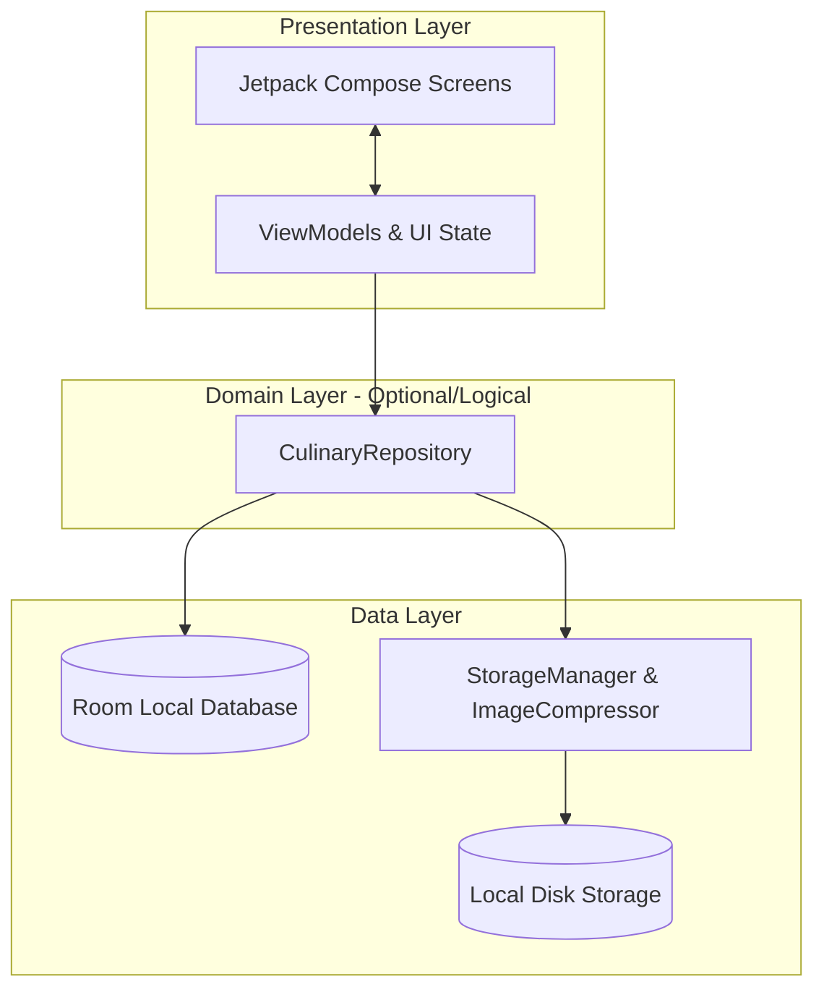
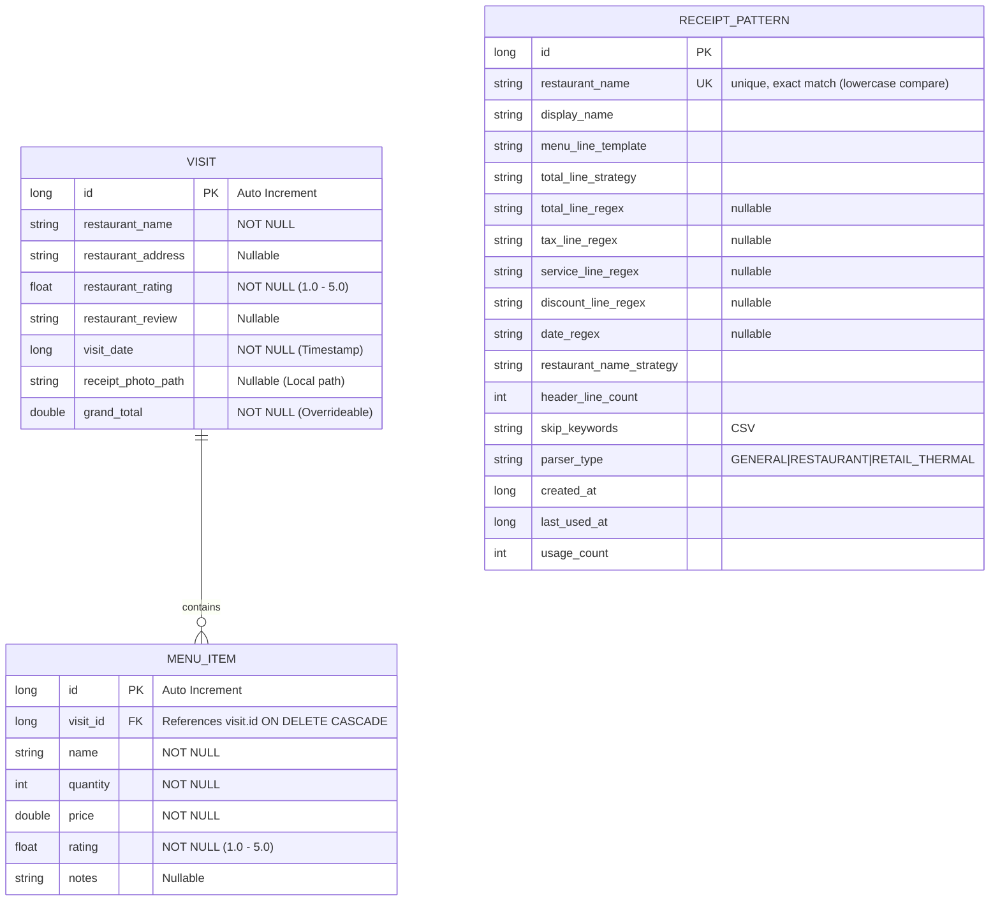
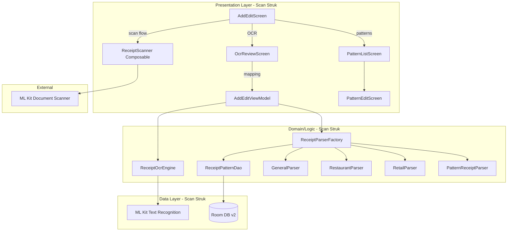

# Architecture Document - Bill Umaba

Dokumen ini mendefinisikan arsitektur perangkat lunak untuk aplikasi Android **Bill Umaba** (pencatat pengeluaran dan ulasan kuliner) dengan pendekatan **MVVM (Model-View-ViewModel)** yang bersifat *offline-first* dan bersih (*clean-ish architectural separation*).

---

## 1. Ikhtisar Arsitektur

Aplikasi Bill Umaba dirancang menggunakan pola arsitektur **MVVM (Model-View-ViewModel)** dengan struktur berlapis (*layered architecture*) yang memisahkan tanggung jawab UI, logika bisnis, dan penyimpanan data.



### 1.1. Prinsip Utama
1.  **Offline-First**: Semua data kunjungan disimpan secara lokal di database Room. Tidak ada ketergantungan pada koneksi internet.
2.  **Single Source of Truth (SSOT)**: Database lokal (`RoomDB`) adalah satu-satunya sumber kebenaran untuk seluruh data transaksi.
3.  **Unidirectional Data Flow (UDF)**:
    *   **State** mengalir ke bawah (dari ViewModel ke UI Screen).
    *   **Events/Intents** mengalir ke atas (dari UI Screen ke ViewModel).
4.  **Aesthetics & M3**: Tampilan modern menggunakan **Material Design 3**, mendukung *Dynamic Color* (Material You) dan *Warm Fallback Theme*.

---

## 2. Struktur Lapisan (Layers)

### 2.1. Presentation Layer (UI)
Bertanggung jawab atas tampilan visual aplikasi dan penanganan interaksi pengguna.

*   **Jetpack Compose**: Digunakan secara eksklusif untuk membangun UI deklaratif.
*   **State-Driven UI**: UI hanya merepresentasikan status terkini (`UiState`) yang dideklarasikan sebagai `StateFlow` di ViewModel.
*   **ViewModels**:
    *   Mewarisi `androidx.lifecycle.ViewModel`.
    *   Mengambil dan mengolah data dari Repository untuk diubah menjadi state UI.
    *   Bertanggung jawab mempertahankan state saat terjadi perubahan konfigurasi (seperti rotasi layar).
    *   Menggunakan Coroutines Scope (`viewModelScope`) untuk operasi asinkron.

### 2.2. Data Layer
Bertanggung jawab untuk membaca dan menulis data ke sumber penyimpanan fisik (Database & File Storage).

*   **Repository Pattern (`CulinaryRepository`)**:
    *   Menyediakan API bersih bagi ViewModel untuk memanipulasi data kunjungan.
    *   Menyembunyikan detail implementasi Room DB dan penyimpanan berkas struk.
*   **Room Database**:
    *   Penyimpanan terstruktur untuk data kunjungan kuliner dan item menu.
    *   Mengembalikan data dalam bentuk aliran asinkron (`Flow<T>`) agar UI dapat otomatis terbarui ketika ada perubahan data.
*   **Storage Manager**:
    *   Mengelola penyimpanan fisik gambar struk di dalam direktori penyimpanan internal aplikasi (`Context.filesDir`).
*   **Image Compressor**:
    *   Melakukan kompresi gambar struk menjadi format JPEG/WebP sebelum disimpan ke disk untuk memastikan ukuran file **maksimal 500 KB** (persyaratan PRD).

---

## 3. Skema Data (Database Schema)

Database lokal diimplementasikan menggunakan Room dengan tiga tabel utama: `visits`, `menu_items` (relasi One-to-Many), dan `receipt_patterns` (tabel independent untuk fitur Scan Struk Tahap 4).



### 3.1. Entity: `VisitEntity` (Tabel `visits`)
Merepresentasikan satu kunjungan kuliner.

| Nama Kolom | Tipe Data Kotlin | Keterangan |
| :--- | :--- | :--- |
| `id` | `Long` | Primary Key, Auto-generate |
| `restaurantName` | `String` | Nama tempat kuliner (Mandatory) |
| `restaurantAddress` | `String?` | Alamat lengkap tempat kuliner (Optional) |
| `restaurantRating` | `Float` | Rating tempat (Desimal 1.0 - 5.0) |
| `restaurantReview` | `String?` | Ulasan pengalaman kuliner secara umum (Optional) |
| `visitDate` | `Long` | Tanggal kunjungan dalam format Epoch Milliseconds |
| `receiptPhotoPath` | `String?` | Path lokal penyimpanan foto struk terkompresi |
| `grandTotal` | `Double` | Total biaya akhir (dapat di-override) |

### 3.2. Entity: `MenuItemEntity` (Tabel `menu_items`)
Merepresentasikan item hidangan yang dipesan pada kunjungan tertentu.

| Nama Kolom | Tipe Data Kotlin | Keterangan |
| :--- | :--- | :--- |
| `id` | `Long` | Primary Key, Auto-generate |
| `visitId` | `Long` | Foreign Key merujuk ke `visits(id)` dengan aksi `ON DELETE CASCADE` |
| `name` | `String` | Nama hidangan/minuman |
| `quantity` | `Int` | Jumlah porsi yang dipesan |
| `price` | `Double` | Harga satuan menu |
| `rating` | `Float` | Rating rasa menu (Desimal 1.0 - 5.0) |
| `notes` | `String?` | Catatan/ulasan spesifik mengenai menu (Optional) |

### 3.3. Entity: `ReceiptPatternEntity` (Tabel `receipt_patterns`) — Scan Struk Tahap 4
Menyimpan "pattern" parsing struk per restoran. Dipakai otomatis saat scan dari tempat yang sama.

| Nama Kolom | Tipe Data Kotlin | Keterangan |
| :--- | :--- | :--- |
| `id` | `Long` | Primary Key, Auto-generate |
| `restaurantName` | `String` | Key lookup (unique, case-insensitive) |
| `displayName` | `String` | Nama tampilan pattern |
| `menuLineTemplate` | `String` | Template regex via `TemplateToRegex.convert()` (mis: `{qty}x {name} {price}`) |
| `totalLineStrategy` | `String` | Enum: `BIGGEST_TOTAL_KEYWORD` / `LAST_LINE` / `CUSTOM_REGEX` |
| `totalLineRegex` | `String?` | Custom regex (jika strategy = `CUSTOM_REGEX`) |
| `taxLineRegex` | `String?` | Regex untuk baris pajak/PPN (nullable) |
| `serviceLineRegex` | `String?` | Regex untuk baris service charge (nullable) |
| `discountLineRegex` | `String?` | Regex untuk baris diskon (nullable) |
| `dateRegex` | `String?` | Regex untuk tanggal (nullable) |
| `restaurantNameStrategy` | `String` | Enum: `FIRST_LINE` / `FIRST_TWO_LINES` / `AUTO_TOP` |
| `headerLineCount` | `Int` | Jumlah baris header (default 2) |
| `skipKeywords` | `String` | CSV kata kunci baris yang di-skip |
| `parserType` | `String` | Enum: `GENERAL` / `RESTAURANT` / `RETAIL_THERMAL` (default `GENERAL`) |
| `createdAt` | `Long` | Timestamp dibuat |
| `lastUsedAt` | `Long` | Timestamp terakhir dipakai |
| `usageCount` | `Int` | Berapa kali dipakai (default 0) |

### 3.4. Database Migration v1 → v2
Schema dimigrasi dengan proper migration (bukan destructive) untuk preserve data existing. Tabel `receipt_patterns` ditambah dengan `CREATE TABLE IF NOT EXISTS` + `CREATE UNIQUE INDEX IF NOT EXISTS`.

---

## 4. Struktur Paket Proyek (Package Structure)

Proyek Android akan diorganisasikan menggunakan struktur **Package by Feature** untuk mempermudah skalabilitas dan pemeliharaan kode:

```text
com.pndnwngi.billumaba/
│
├── data/
│   ├── database/
│   │   ├── AppDatabase.kt              # version 2 (v1→v2 migration)
│   │   ├── Migrations.kt               # MIGRATION_1_2 (CREATE receipt_patterns)
│   │   ├── dao/
│   │   │   ├── VisitDao.kt
│   │   │   ├── MenuDao.kt
│   │   │   └── ReceiptPatternDao.kt    # NEW (Scan Struk - Tahap 4)
│   │   └── entities/
│   │       ├── VisitEntity.kt
│   │       ├── MenuItemEntity.kt
│   │       └── ReceiptPatternEntity.kt # NEW (Scan Struk - Tahap 4)
│   │
│   ├── ocr/                            # NEW (Scan Struk - Tahap 2)
│   │   ├── OcrModels.kt                # OcrResult, OcrLine
│   │   └── ReceiptOcrEngine.kt         # ML Kit wrapper
│   │
│   ├── parser/                         # NEW (Scan Struk - Tahap 3 & 4)
│   │   ├── ParsedReceipt.kt            # data class + ParserType enum + interface
│   │   ├── GeneralReceiptParser.kt
│   │   ├── RestaurantReceiptParser.kt
│   │   ├── RetailThermalParser.kt
│   │   ├── ReceiptParserFactory.kt     # auto-detect + pattern lookup
│   │   ├── PatternReceiptParser.kt     # parse dari ReceiptPatternEntity
│   │   └── TemplateToRegex.kt          # visual template → regex converter
│   │
│   ├── repository/
│   │   ├── CulinaryRepository.kt
│   │   └── CulinaryRepositoryImpl.kt
│   │
│   └── storage/
│       ├── StorageManager.kt
│       └── ImageCompressor.kt
│
├── di/
│   ├── DatabaseModule.kt               # MODIFIED: addMigrations(MIGRATION_1_2)
│   └── RepositoryModule.kt
│
├── ui/
│   ├── navigation/
│   │   ├── Screen.kt                   # MODIFIED: +ocr_review, +patterns, +patterns/edit
│   │   └── AppNavigation.kt            # MODIFIED: +3 composable destinations
│   │
│   ├── theme/
│   │   ├── Color.kt
│   │   ├── Theme.kt
│   │   └── Type.kt
│   │
│   ├── components/                     # Komponen UI global
│   │   ├── StarRating.kt
│   │   ├── PhotoPicker.kt              # MODIFIED: bottom sheet 3 opsi (Scan default)
│   │   └── ReceiptScanner.kt           # NEW (Scan Struk - Tahap 1)
│   │
│   ├── dashboard/                      # Fitur 2.1: Dashboard & Riwayat
│   │   ├── DashboardScreen.kt          # MODIFIED: +ikon ⚙ → Pattern Management
│   │   ├── DashboardViewModel.kt
│   │   └── DashboardUiState.kt
│   │
│   ├── addedit/                        # Fitur 2.2: Tambah & Edit (Scan Struk integrated)
│   │   ├── AddEditScreen.kt            # MODIFIED: tombol Ekstrak Teks, Scan Ulang
│   │   ├── AddEditViewModel.kt         # MODIFIED: OCR + parse + save pattern handlers
│   │   └── AddEditUiState.kt           # MODIFIED: scan/OCR/pattern fields
│   │
│   ├── ocr/                            # NEW (Scan Struk - Tahap 2 & 3)
│   │   ├── OcrReviewScreen.kt          # Editable OCR lines + parser type UI
│   │   ├── OcrReviewViewModel.kt       # Parser integration (Tahap 3)
│   │   └── OcrReviewUiState.kt
│   │
│   ├── patterns/                       # NEW (Scan Struk - Tahap 4)
│   │   ├── PatternListScreen.kt
│   │   ├── PatternListViewModel.kt
│   │   ├── PatternListUiState.kt
│   │   ├── PatternEditScreen.kt        # Visual builder
│   │   ├── PatternEditViewModel.kt
│   │   └── PatternEditUiState.kt
│   │
│   ├── detail/                         # Fitur 2.3: Tampilan Detail
│   │   ├── DetailScreen.kt
│   │   ├── DetailViewModel.kt
│   │   └── DetailUiState.kt
│   │
│   └── util/
│       └── GooglePlayServicesUtil.kt   # NEW (Scan Struk - Tahap 1)
│
└── MainActivity.kt
```

---

## 5. Alur Data & State Management

Setiap layar mengadopsi pola penyediaan state sebagai berikut:

### 5.1. Contoh UI State untuk Dashboard (`DashboardUiState`)
```kotlin
data class DashboardUiState(
    val isLoading: Boolean = false,
    val visits: List<VisitWithMenus> = emptyList(),
    val totalExpenseThisMonth: Double = 0.0,
    val totalVisitsCount: Int = 0,
    val searchQuery: String = "",
    val sortOrder: SortOrder = SortOrder.DATE_DESC,
    val errorMessage: String? = null
)

enum class SortOrder {
    DATE_DESC, DATE_ASC,
    PRICE_DESC, PRICE_ASC,
    RATING_DESC, RATING_ASC
}
```

### 5.2. Alur Simpan Kunjungan (Add/Edit Flow)
1.  Pengguna mengisi data di `AddEditScreen`.
2.  Setiap perubahan (misal: mengetik nama restoran) memicu *intent* ke `AddEditViewModel` untuk memperbarui `AddEditUiState`.
3.  Ketika memilih foto struk:
    *   ViewModel memanggil `StorageManager` untuk menyalin berkas.
    *   `ImageCompressor` dijalankan secara *asynchronous* menggunakan `Dispatchers.Default` untuk mengubah ukuran dan memangkas ukuran berkas hingga `< 500 KB`.
    *   Path lokal dari berkas yang disimpan berhasil dicatat ke dalam UI State.
4.  Pengguna menekan "Simpan".
5.  ViewModel melakukan validasi. Jika valid, memanggil `CulinaryRepository.saveVisit(visit, menus)` melalui `viewModelScope`.
6.  Repository melakukan *database write* di dalam blok transaksi (`RoomDB.withTransaction`).
7.  Setelah sukses, ViewModel memicu navigasi kembali ke Dashboard, dan aliran data Room secara otomatis memperbarui Dashboard.

### 5.3. Alur Scan Struk (Pipeline 4 Tahap)
Scan Struk menambahkan 4 subsistem ke arsitektur MVVM yang sudah ada. Pipeline: `Scan → OCR → Mapping → Pattern Lookup`.



**Tahap 1 — Auto-Frame**: User tap "Scan" di AddEditScreen → `ReceiptScanner` Composable wrap ML Kit Document Scanner → foto dikembalikan (sudah lurus & cropped) → `AddEditViewModel.onScannedPhoto(uri)` compress + save. GMS unavailable → fallback dialog → kamera biasa.

**Tahap 2 — OCR**: User tap "Ekstrak Teks" → `AddEditViewModel.runOcr()` → `ReceiptOcrEngine.recognize()` (ML Kit Text Recognition Latin, on-device) → `OcrResult` di-share ke `OcrReviewScreen` via `rememberSaveable` di NavHost. User bisa edit baris teks.

**Tahap 3 — Mapping**: `OcrReviewViewModel.runDetection()` rebuild `OcrResult` dari edited lines → `ReceiptParserFactory.parse(ocr, overrideType)`:
1. Pattern lookup by `restaurantName` → `PatternReceiptParser` (Tahap 4)
2. Auto-detect by keyword (cash markers → RETAIL, subtotal+pajak → RESTAURANT, else → GENERAL)
3. Override manual oleh user

User tap "Pakai Hasil Scan" → parsed receipt di-share ke AddEditScreen → `AddEditViewModel.applyParsedReceipt()` populates form.

**Tahap 4 — Dynamic Pattern**: User buka Dashboard → ikon ⚙ → `PatternListScreen`. Tap `+` → `PatternEditScreen` (visual builder: token QTY/NAMA/HARGA/SUBTOTAL, dropdown strategi, skip keywords, switch regex opsional). "Test dengan foto" → run OCR + parse → preview. Save → `ReceiptPatternDao.upsert()`. Next scan dari tempat yang sama → pattern dipakai otomatis (override auto-detect).

---

## 6. Komponen Kunci Non-Fungsional

### 6.1. Optimasi & Kompresi Struk (`ImageCompressor`)
Untuk memenuhi batas penyimpanan **500 KB** per foto:
*   Resolusi gambar diturunkan secara proporsional jika terlalu besar (maksimal lebar/tinggi 1920px).
*   Format kompresi menggunakan `Bitmap.CompressFormat.JPEG` atau `WEBP_JPEG_COMPATIBLE` dengan kualitas *quality factor* awal 80%.
*   Jika ukuran masih melebihi 500 KB, rasio kualitas diturunkan bertahap (70%, 60%) melalui fungsi iteratif hingga mendapatkan file di bawah limit.

### 6.2. Tema Dinamis (Material Design 3)
*   **Dynamic Theme**: Menggunakan API `dynamicLightColorScheme` dan `dynamicDarkColorScheme` untuk Android 12+ (API 31+).
*   **Warm Fallback**: Jika dinamis tidak aktif, skema warna diinisialisasi menggunakan palet kuliner hangat (Primary: Amber/Orange, Secondary: Terracotta/Warm Brown).

---

## 7. Kebutuhan Dependensi (Libraries)

Berikut adalah daftar pustaka Android Jetpack yang diperlukan untuk implementasi arsitektur ini. Konfigurasi ini harus didaftarkan pada file `libs.versions.toml` dan Gradle aplikasi.

### 7.1. Database (Room)
```toml
# libs.versions.toml
room = "2.6.1"
androidx-room-runtime = { group = "androidx.room", name = "room-runtime", version.ref = "room" }
androidx-room-ktx = { group = "androidx.room", name = "room-ktx", version.ref = "room" }
androidx-room-compiler = { group = "androidx.room", name = "room-compiler", version.ref = "room" }
```

### 7.2. Dependency Injection (Hilt)
```toml
# libs.versions.toml
hilt = "2.51.1"
hiltNavigationCompose = "1.2.0"
dagger-hilt-android = { group = "com.google.dagger", name = "hilt-android", version.ref = "hilt" }
dagger-hilt-compiler = { group = "com.google.dagger", name = "hilt-compiler", version.ref = "hilt" }
androidx-hilt-navigation-compose = { group = "androidx.hilt", name = "hilt-navigation-compose", version.ref = "hiltNavigationCompose" }
```

### 7.3. Navigation
```toml
# libs.versions.toml
navigationCompose = "2.8.7"
androidx-navigation-compose = { group = "androidx.navigation", name = "navigation-compose", version.ref = "navigationCompose" }
```

### 7.4. ML Kit (Scan Struk)
```toml
# libs.versions.toml
mlkit-document-scanner = "16.0.0-beta1"
mlkit-text-recognition-latin = "16.0.0.1"
coroutines-play-services = "1.8.1"

androidx-mlkit-document-scanner = { group = "com.google.mlkit", name = "document-scanner", version.ref = "mlkit-document-scanner" }
androidx-mlkit-text-recognition-latin = { group = "com.google.mlkit", name = "text-recognition-latin", version.ref = "mlkit-text-recognition-latin" }
kotlinx-coroutines-play-services = { group = "org.jetbrains.kotlinx", name = "kotlinx-coroutines-play-services", version.ref = "coroutines-play-services" }
```

```kotlin
// app/build.gradle.kts — additions
dependencies {
    // ... existing ...
    implementation(libs.androidx.mlkit.document.scanner)
    implementation(libs.androidx.mlkit.text.recognition.latin)
    implementation(libs.kotlinx.coroutines.play.services)
}
```

**Constraint**: ML Kit Document Scanner butuh Google Play Services. Check via `GoogleApiAvailability` sebelum launch. Fallback ke Camera biasa jika tidak tersedia. ML Kit Text Recognition Latin sudah bundled (offline), tidak butuh GMS untuk runtime.

---

## 8. Navigation Routes

```kotlin
sealed class Screen(val route: String) {
    data object Dashboard : Screen("dashboard")
    data object AddEdit : Screen("add_edit?visitId={visitId}") {
        fun createRoute(visitId: Long? = null): String =
            if (visitId != null) "add_edit?visitId=$visitId" else "add_edit"
    }
    data object Detail : Screen("detail/{visitId}") {
        fun createRoute(visitId: Long): String = "detail/$visitId"
    }
    // Scan Struk routes
    data object OcrReview : Screen("ocr_review")
    data object PatternList : Screen("patterns")
    data object PatternEdit : Screen("patterns/edit?id={id}") {
        fun createRoute(id: Long? = null): String =
            if (id != null) "patterns/edit?id=$id" else "patterns/edit"
    }
}
```

Scan Struk menambah 3 routes baru. Shared state (`pendingOcrResult`, `pendingParsedReceipt`) digunakan via `rememberSaveable` di NavHost level untuk passing data antar `AddEditScreen` dan `OcrReviewScreen`.

---

## 9. Pola Parser (Scan Struk)

```
ReceiptParser (interface)
├── GeneralReceiptParser      # heuristic dasar (Umum)
├── RestaurantReceiptParser   # handle subtotal + pajak + service (Resto)
├── RetailThermalParser       # cash register format (Retail)
└── PatternReceiptParser      # dari ReceiptPatternEntity (custom user)
```

`ReceiptParserFactory.parse()` priority:
1. Pattern lookup by `restaurantName` → `PatternReceiptParser` + update `lastUsedAt`/`usageCount`
2. Auto-detect by keyword → salah satu dari 3 preset
3. Override manual oleh user → sesuai pilihan dropdown

Template visual di-convert ke regex via `TemplateToRegex.convert()`:
- Token: `{qty}`, `{name}`, `{price}`, `{subtotal}`
- Proses: `Regex.escape()` seluruh template → replace escaped tokens dengan named group regex (`(?<qty>\d+)`, `(?<name>.+?)`, `(?<price>[\d.,]+)`, `(?<subtotal>[\d.,]+)`).
- Output: `Regex(pattern, RegexOption.IGNORE_CASE)`.

---

## 10. Catatan Perubahan terhadap Arsitektur Existing

| Komponen | Status | Catatan |
|---|---|---|
| `AppDatabase` | **MODIFIED** | Version 1→2, +ReceiptPatternEntity, +receiptPatternDao() |
| `DatabaseModule` | **MODIFIED** | +addMigrations(MIGRATION_1_2), +provideReceiptPatternDao |
| `AddEditViewModel` | **MODIFIED** | +ReceiptOcrEngine, +ReceiptPatternDao inject; +scan/OCR/parse/pattern handlers |
| `AddEditUiState` | **MODIFIED** | +scan/OCR/parsedReceipt fields |
| `PhotoPicker` | **MODIFIED** | 2 tombol → bottom sheet 3 opsi (Scan default) |
| `Screen.kt` | **MODIFIED** | +3 routes: ocr_review, patterns, patterns/edit |
| `AppNavigation.kt` | **MODIFIED** | +3 composable destinations, +shared state (pendingOcrResult, pendingParsedReceipt) |
| `DashboardScreen` | **MODIFIED** | +IconButton Settings di TopAppBar → PatternList |

Tidak ada perubahan pada: tema M3, schema `visits`/`menu_items`, format foto JPEG <500KB, dependencies Room/Hilt/Compose/Coil. Hanya tambah ML Kit libraries untuk fitur Scan Struk.
