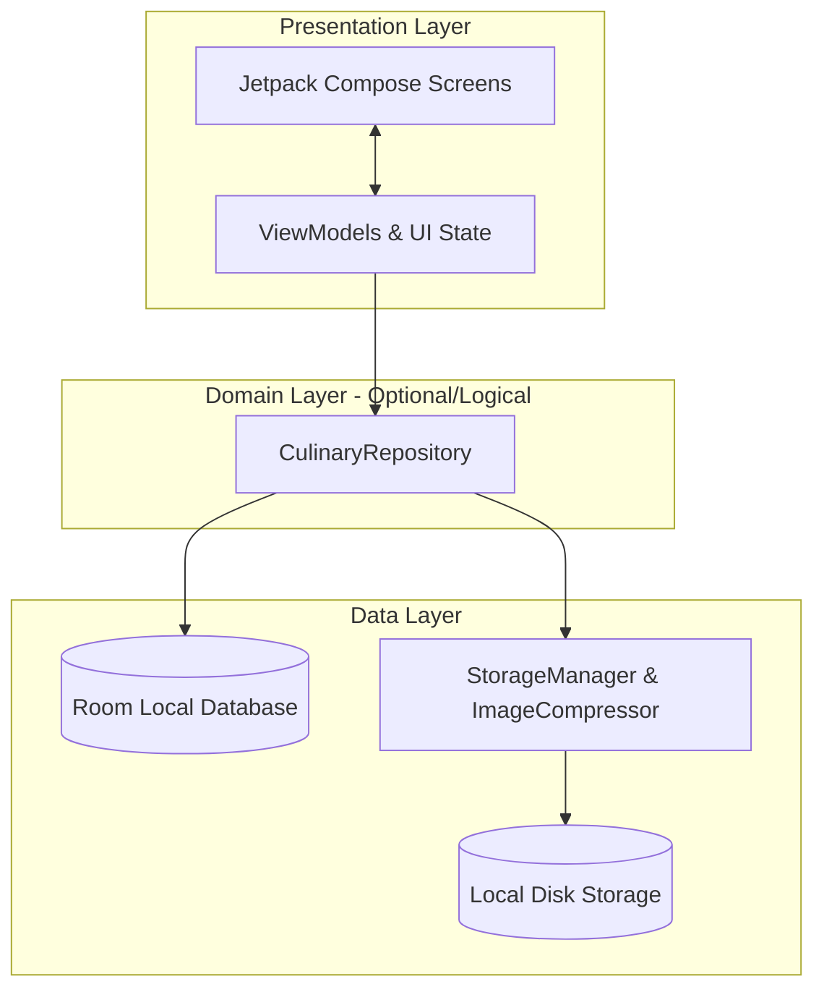
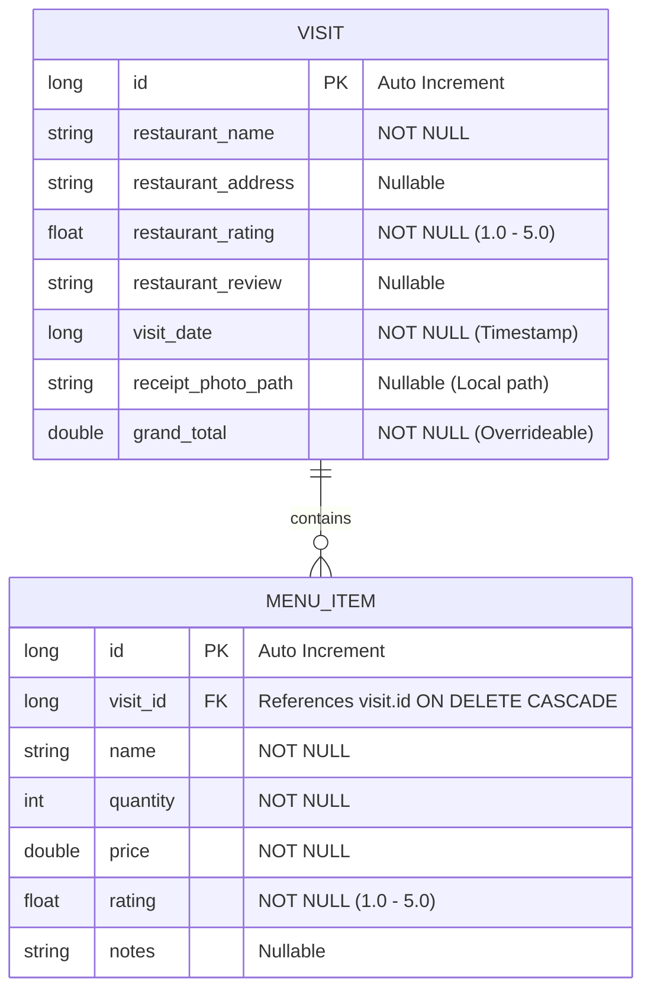

# Architecture Document - Bill Umaba

Dokumen ini mendefinisikan arsitektur perangkat lunak untuk aplikasi Android **Bill Umaba** (pencatat pengeluaran dan ulasan kuliner) dengan pendekatan **MVVM (Model-View-ViewModel)** yang bersifat *offline-first* dan bersih (*clean-ish architectural separation*).

---

## 1. Ikhtisar Arsitektur

Aplikasi Bill Umaba dirancang menggunakan pola arsitektur **MVVM (Model-View-ViewModel)** dengan struktur berlapis (*layered architecture*) yang memisahkan tanggung jawab UI, logika bisnis, dan penyimpanan data.



### 1.1. Prinsip Utama
1.  **Offline-First**: Semua data kunjungan disimpan secara lokal di database Room. Tidak ada ketergantungan pada koneksi internet.
2.  **Single Source of Truth (SSOT)**: Database lokal (`RoomDB`) adalah satu-satunya sumber kebenaran untuk seluruh data transaksi.
3.  **Unidirectional Data Flow (UDF)**:
    *   **State** mengalir ke bawah (dari ViewModel ke UI Screen).
    *   **Events/Intents** mengalir ke atas (dari UI Screen ke ViewModel).
4.  **Aesthetics & M3**: Tampilan modern menggunakan **Material Design 3**, mendukung *Dynamic Color* (Material You) dan *Warm Fallback Theme*.

---

## 2. Struktur Lapisan (Layers)

### 2.1. Presentation Layer (UI)
Bertanggung jawab atas tampilan visual aplikasi dan penanganan interaksi pengguna.

*   **Jetpack Compose**: Digunakan secara eksklusif untuk membangun UI deklaratif.
*   **State-Driven UI**: UI hanya merepresentasikan status terkini (`UiState`) yang dideklarasikan sebagai `StateFlow` di ViewModel.
*   **ViewModels**:
    *   Mewarisi `androidx.lifecycle.ViewModel`.
    *   Mengambil dan mengolah data dari Repository untuk diubah menjadi state UI.
    *   Bertanggung jawab mempertahankan state saat terjadi perubahan konfigurasi (seperti rotasi layar).
    *   Menggunakan Coroutines Scope (`viewModelScope`) untuk operasi asinkron.

### 2.2. Data Layer
Bertanggung jawab untuk membaca dan menulis data ke sumber penyimpanan fisik (Database & File Storage).

*   **Repository Pattern (`CulinaryRepository`)**:
    *   Menyediakan API bersih bagi ViewModel untuk memanipulasi data kunjungan.
    *   Menyembunyikan detail implementasi Room DB dan penyimpanan berkas struk.
*   **Room Database**:
    *   Penyimpanan terstruktur untuk data kunjungan kuliner dan item menu.
    *   Mengembalikan data dalam bentuk aliran asinkron (`Flow<T>`) agar UI dapat otomatis terbarui ketika ada perubahan data.
*   **Storage Manager**:
    *   Mengelola penyimpanan fisik gambar struk di dalam direktori penyimpanan internal aplikasi (`Context.filesDir`).
*   **Image Compressor**:
    *   Melakukan kompresi gambar struk menjadi format JPEG/WebP sebelum disimpan ke disk untuk memastikan ukuran file **maksimal 500 KB** (persyaratan PRD).

---

## 3. Skema Data (Database Schema)

Database lokal diimplementasikan menggunakan Room dengan dua tabel utama yang saling berelasi: `visits` dan `menu_items` (relasi One-to-Many).



### 3.1. Entity: `VisitEntity` (Tabel `visits`)
Merepresentasikan satu kunjungan kuliner.

| Nama Kolom | Tipe Data Kotlin | Keterangan |
| :--- | :--- | :--- |
| `id` | `Long` | Primary Key, Auto-generate |
| `restaurantName` | `String` | Nama tempat kuliner (Mandatory) |
| `restaurantAddress` | `String?` | Alamat lengkap tempat kuliner (Optional) |
| `restaurantRating` | `Float` | Rating tempat (Desimal 1.0 - 5.0) |
| `restaurantReview` | `String?` | Ulasan pengalaman kuliner secara umum (Optional) |
| `visitDate` | `Long` | Tanggal kunjungan dalam format Epoch Milliseconds |
| `receiptPhotoPath` | `String?` | Path lokal penyimpanan foto struk terkompresi |
| `grandTotal` | `Double` | Total biaya akhir (dapat di-override) |

### 3.2. Entity: `MenuItemEntity` (Tabel `menu_items`)
Merepresentasikan item hidangan yang dipesan pada kunjungan tertentu.

| Nama Kolom | Tipe Data Kotlin | Keterangan |
| :--- | :--- | :--- |
| `id` | `Long` | Primary Key, Auto-generate |
| `visitId` | `Long` | Foreign Key merujuk ke `visits(id)` dengan aksi `ON DELETE CASCADE` |
| `name` | `String` | Nama hidangan/minuman |
| `quantity` | `Int` | Jumlah porsi yang dipesan |
| `price` | `Double` | Harga satuan menu |
| `rating` | `Float` | Rating rasa menu (Desimal 1.0 - 5.0) |
| `notes` | `String?` | Catatan/ulasan spesifik mengenai menu (Optional) |

---

## 4. Struktur Paket Proyek (Package Structure)

Proyek Android akan diorganisasikan menggunakan struktur **Package by Feature** untuk mempermudah skalabilitas dan pemeliharaan kode:

```text
com.pndnwngi.billumaba/
│
├── data/
│   ├── database/
│   │   ├── AppDatabase.kt
│   │   ├── dao/
│   │   │   ├── VisitDao.kt
│   │   │   └── MenuDao.kt
│   │   └── entities/
│   │       ├── VisitEntity.kt
│   │       └── MenuItemEntity.kt
│   │
│   ├── repository/
│   │   ├── CulinaryRepository.kt
│   │   └── CulinaryRepositoryImpl.kt
│   │
│   └── storage/
│       ├── StorageManager.kt
│       └── ImageCompressor.kt
│
├── di/
│   ├── DatabaseModule.kt
│   └── RepositoryModule.kt
│
├── ui/
│   ├── navigation/
│   │   ├── Screen.kt
│   │   └── AppNavigation.kt
│   │
│   ├── theme/
│   │   ├── Color.kt
│   │   ├── Theme.kt
│   │   └── Type.kt
│   │
│   ├── components/                 # Komponen UI global (RatingBar, CustomButton, dll.)
│   │   ├── StarRating.kt
│   │   └── PhotoPicker.kt
│   │
│   ├── dashboard/                  # Fitur 2.1: Dashboard & Riwayat
│   │   ├── DashboardScreen.kt
│   │   ├── DashboardViewModel.kt
│   │   └── DashboardUiState.kt
│   │
│   ├── addedit/                    # Fitur 2.2: Tambah & Edit
│   │   ├── AddEditScreen.kt
│   │   ├── AddEditViewModel.kt
│   │   └── AddEditUiState.kt
│   │
│   └── detail/                     # Fitur 2.3: Tampilan Detail
│       ├── DetailScreen.kt
│       ├── DetailViewModel.kt
│       └── DetailUiState.kt
│
└── MainActivity.kt
```

---

## 5. Alur Data & State Management

Setiap layar mengadopsi pola penyediaan state sebagai berikut:

### 5.1. Contoh UI State untuk Dashboard (`DashboardUiState`)
```kotlin
data class DashboardUiState(
    val isLoading: Boolean = false,
    val visits: List<VisitWithMenus> = emptyList(),
    val totalExpenseThisMonth: Double = 0.0,
    val totalVisitsCount: Int = 0,
    val searchQuery: String = "",
    val sortOrder: SortOrder = SortOrder.DATE_DESC,
    val errorMessage: String? = null
)

enum class SortOrder {
    DATE_DESC, DATE_ASC,
    PRICE_DESC, PRICE_ASC,
    RATING_DESC, RATING_ASC
}
```

### 5.2. Alur Simpan Kunjungan (Add/Edit Flow)
1.  Pengguna mengisi data di `AddEditScreen`.
2.  Setiap perubahan (misal: mengetik nama restoran) memicu *intent* ke `AddEditViewModel` untuk memperbarui `AddEditUiState`.
3.  Ketika memilih foto struk:
    *   ViewModel memanggil `StorageManager` untuk menyalin berkas.
    *   `ImageCompressor` dijalankan secara *asynchronous* menggunakan `Dispatchers.Default` untuk mengubah ukuran dan memangkas ukuran berkas hingga `< 500 KB`.
    *   Path lokal dari berkas yang disimpan berhasil dicatat ke dalam UI State.
4.  Pengguna menekan "Simpan".
5.  ViewModel melakukan validasi. Jika valid, memanggil `CulinaryRepository.saveVisit(visit, menus)` melalui `viewModelScope`.
6.  Repository melakukan *database write* di dalam blok transaksi (`RoomDB.withTransaction`).
7.  Setelah sukses, ViewModel memicu navigasi kembali ke Dashboard, dan aliran data Room secara otomatis memperbarui Dashboard.

---

## 6. Komponen Kunci Non-Fungsional

### 6.1. Optimasi & Kompresi Struk (`ImageCompressor`)
Untuk memenuhi batas penyimpanan **500 KB** per foto:
*   Resolusi gambar diturunkan secara proporsional jika terlalu besar (maksimal lebar/tinggi 1920px).
*   Format kompresi menggunakan `Bitmap.CompressFormat.JPEG` atau `WEBP_JPEG_COMPATIBLE` dengan kualitas *quality factor* awal 80%.
*   Jika ukuran masih melebihi 500 KB, rasio kualitas diturunkan bertahap (70%, 60%) melalui fungsi iteratif hingga mendapatkan file di bawah limit.

### 6.2. Tema Dinamis (Material Design 3)
*   **Dynamic Theme**: Menggunakan API `dynamicLightColorScheme` dan `dynamicDarkColorScheme` untuk Android 12+ (API 31+).
*   **Warm Fallback**: Jika dinamis tidak aktif, skema warna diinisialisasi menggunakan palet kuliner hangat (Primary: Amber/Orange, Secondary: Terracotta/Warm Brown).

---

## 7. Kebutuhan Dependensi (Libraries)

Berikut adalah daftar pustaka Android Jetpack yang diperlukan untuk implementasi arsitektur ini. Konfigurasi ini harus didaftarkan pada file `libs.versions.toml` dan Gradle aplikasi.

### 7.1. Database (Room)
```toml
# libs.versions.toml
room = "2.6.1"
androidx-room-runtime = { group = "androidx.room", name = "room-runtime", version.ref = "room" }
androidx-room-ktx = { group = "androidx.room", name = "room-ktx", version.ref = "room" }
androidx-room-compiler = { group = "androidx.room", name = "room-compiler", version.ref = "room" }
```

### 7.2. Dependency Injection (Hilt)
```toml
# libs.versions.toml
hilt = "2.51.1"
hiltNavigationCompose = "1.2.0"
dagger-hilt-android = { group = "com.google.dagger", name = "hilt-android", version.ref = "hilt" }
dagger-hilt-compiler = { group = "com.google.dagger", name = "hilt-compiler", version.ref = "hilt" }
androidx-hilt-navigation-compose = { group = "androidx.hilt", name = "hilt-navigation-compose", version.ref = "hiltNavigationCompose" }
```

### 7.3. Navigation
```toml
# libs.versions.toml
navigationCompose = "2.8.7"
androidx-navigation-compose = { group = "androidx.navigation", name = "navigation-compose", version.ref = "navigationCompose" }
```
