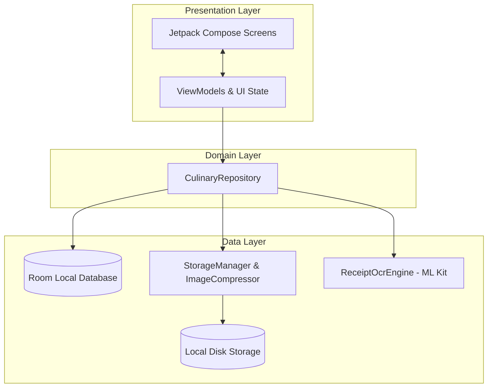
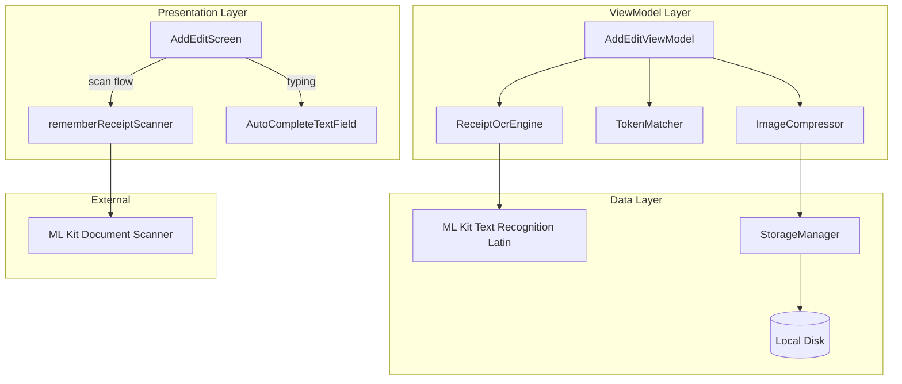

# Architecture Document - Bill Umaba

Dokumen ini mendefinisikan arsitektur perangkat lunak untuk aplikasi Android **Bill Umaba** (pencatat pengeluaran dan ulasan kuliner) dengan pendekatan **MVVM (Model-View-ViewModel)** yang bersifat *offline-first*.

---

## 1. Ikhtisar Arsitektur

Aplikasi Bill Umaba dirancang menggunakan pola arsitektur **MVVM (Model-View-ViewModel)** dengan struktur berlapis (*layered architecture*) yang memisahkan tanggung jawab UI, logika bisnis, dan penyimpanan data.



### 1.1. Prinsip Utama
1. **Offline-First**: Semua data kunjungan disimpan secara lokal di database Room. Tidak ada ketergantungan pada koneksi internet.
2. **Single Source of Truth (SSOT)**: Database lokal (`RoomDB`) adalah satu-satunya sumber kebenaran untuk seluruh data transaksi.
3. **Unidirectional Data Flow (UDF)**:
    - **State** mengalir ke bawah (dari ViewModel ke UI Screen).
    - **Events/Intents** mengalir ke atas (dari UI Screen ke ViewModel).
4. **Aesthetics & M3**: Tampilan modern menggunakan **Material Design 3**, mendukung *Dynamic Color* (Material You) dan *Warm Fallback Theme*.

---

## 2. Struktur Lapisan (Layers)

### 2.1. Presentation Layer (UI)
Bertanggung jawab atas tampilan visual aplikasi dan penanganan interaksi pengguna.

- **Jetpack Compose**: Digunakan secara eksklusif untuk membangun UI deklaratif.
- **State-Driven UI**: UI hanya merepresentasikan status terkini (`UiState`) yang dideklarasikan sebagai `StateFlow` di ViewModel.
- **ViewModels**:
    - Mewarisi `androidx.lifecycle.ViewModel`.
    - Mengambil dan mengolah data dari Repository untuk diubah menjadi state UI.
    - Bertanggung jawab mempertahankan state saat terjadi perubahan konfigurasi (seperti rotasi layar).
    - Menggunakan Coroutines Scope (`viewModelScope`) untuk operasi asinkron.

### 2.2. Data Layer
Bertanggung jawab untuk membaca dan menulis data ke sumber penyimpanan fisik (Database & File Storage).

- **Repository Pattern (`CulinaryRepository`)**:
    - Menyediakan API bersih bagi ViewModel untuk memanipulasi data kunjungan.
    - Menyembunyikan detail implementasi Room DB dan penyimpanan berkas struk.
- **Room Database**:
    - Penyimpanan terstruktur untuk data kunjungan kuliner dan item menu.
    - Mengembalikan data dalam bentuk aliran asinkron (`Flow<T>`) agar UI dapat otomatis terbarui ketika ada perubahan data.
- **Storage Manager**:
    - Mengelola penyimpanan fisik gambar struk di dalam direktori penyimpanan internal aplikasi (`Context.filesDir`).
- **Image Compressor**:
    - Melakukan kompresi gambar struk menjadi format JPEG sebelum disimpan ke disk untuk memastikan ukuran file **maksimal 500 KB** (persyaratan PRD).
- **Receipt OCR Engine**:
    - Wrapper untuk ML Kit Text Recognition Latin (on-device).
    - Mengenali teks dari URI gambar, menghasilkan `OcrResult` (daftar `OcrLine`).
    - Berjalan di `Dispatchers.Default` (background thread).

---

## 3. Skema Data (Database Schema)

Database lokal diimplementasikan menggunakan Room dengan dua tabel: `visits` dan `menu_items` (relasi One-to-Many).


### 3.1. Entity: `VisitEntity` (Tabel `visits`)
Merepresentasikan satu kunjungan kuliner.

| Nama Kolom | Tipe Data Kotlin | Keterangan |
| :--- | :--- | :--- |
| `id` | `Long` | Primary Key, Auto-generate |
| `restaurantName` | `String` | Nama tempat kuliner (Mandatory) |
| `restaurantAddress` | `String?` | Alamat lengkap tempat kuliner (Optional) |
| `restaurantRating` | `Float` | Rating tempat (Desimal 1.0 - 5.0) |
| `restaurantReview` | `String?` | Ulasan pengalaman kuliner secara umum (Optional) |
| `visitDate` | `Long` | Tanggal kunjungan dalam format Epoch Milliseconds |
| `receiptPhotoPath` | `String?` | Path lokal penyimpanan foto struk terkompresi |
| `grandTotal` | `Double` | Total biaya akhir (dapat di-override) |

### 3.2. Entity: `MenuItemEntity` (Tabel `menu_items`)
Merepresentasikan item hidangan yang dipesan pada kunjungan tertentu.

| Nama Kolom | Tipe Data Kotlin | Keterangan |
| :--- | :--- | :--- |
| `id` | `Long` | Primary Key, Auto-generate |
| `visitId` | `Long` | Foreign Key merujuk ke `visits(id)` dengan aksi `ON DELETE CASCADE` |
| `name` | `String` | Nama hidangan/minuman |
| `quantity` | `Int` | Jumlah porsi yang dipesan |
| `price` | `Double` | Harga satuan menu |
| `rating` | `Float` | Rating rasa menu (Desimal 1.0 - 5.0) |
| `notes` | `String?` | Catatan/ulasan spesifik mengenai menu (Optional) |

### 3.3. Relasi: `VisitWithMenus`
POJO relasi Room menggunakan anotasi `@Embedded` + `@Relation` untuk menggabungkan `VisitEntity` dengan `List<MenuItemEntity>`.

### 3.4. Database Version

Schema saat ini berada di **version 1**. Menggunakan `fallbackToDestructiveMigrationOnDowngrade()` tanpa migration kustom. Fitur mendatang (Parsing Struk Tahap 3-4) akan menambah migration.

---

## 4. Struktur Paket Proyek (Package Structure)

Proyek Android diorganisasikan menggunakan struktur **Package by Feature**:

```text
com.pndnwngi.billumaba/
│
├── BillUmabaApplication.kt         # @HiltAndroidApp
├── MainActivity.kt                 # Entry point, setContent + AppNavigation
│
├── util/
│   └── GooglePlayServicesUtil.kt   # GMS availability check
│
├── di/
│   ├── DatabaseModule.kt           # Provides AppDatabase, VisitDao, MenuDao
│   ├── RepositoryModule.kt         # Binds CulinaryRepositoryImpl → CulinaryRepository
│   └── OcrModule.kt                # Placeholder (empty, prepared for parser/providers)
│
├── data/
│   ├── database/
│   │   ├── AppDatabase.kt          # version 1, entities: VisitEntity, MenuItemEntity
│   │   ├── dao/
│   │   │   ├── VisitDao.kt
│   │   │   └── MenuDao.kt
│   │   └── entities/
│   │       ├── VisitEntity.kt
│   │       ├── MenuItemEntity.kt
│   │       └── VisitWithMenus.kt
│   │
│   ├── ocr/
│   │   ├── OcrModels.kt            # OcrResult, OcrLine (Parcelable)
│   │   └── ReceiptOcrEngine.kt     # ML Kit Text Recognition Latin wrapper
│   │
│   ├── repository/
│   │   ├── CulinaryRepository.kt       # Interface
│   │   └── CulinaryRepositoryImpl.kt   # Implementation
│   │
│   └── storage/
│       ├── StorageManager.kt       # File I/O (save/delete receipt images)
│       └── ImageCompressor.kt      # Compress to max 500KB
│
├── ui/
│   ├── navigation/
│   │   ├── Screen.kt               # 3 routes: Dashboard, AddEdit, Detail
│   │   └── AppNavigation.kt        # NavHost with 3 composable destinations
│   │
│   ├── theme/
│   │   ├── Color.kt
│   │   ├── Theme.kt
│   │   └── Type.kt
│   │
│   ├── components/
│   │   ├── StarRating.kt           # StarRatingInput, StarRatingDisplay
│   │   ├── PhotoPicker.kt          # Bottom sheet (Scan/Kamera/Galeri) + PhotoPickerWithPhoto
│   │   └── ReceiptScanner.kt       # rememberReceiptScanner (ML Kit Doc Scanner wrapper)
│   │
│   ├── dashboard/
│   │   ├── DashboardScreen.kt      # Visit list, metrics, search, sort, FAB
│   │   ├── DashboardViewModel.kt
│   │   └── DashboardUiState.kt     # monthlyExpense, totalVisits, searchQuery, sortType, visits
│   │
│   ├── addedit/
│   │   ├── AddEditScreen.kt        # Form + inline OCR autocomplete (AutoCompleteTextField)
│   │   ├── AddEditViewModel.kt     # OCR engine, compress, save, autocomplete suggestions
│   │   ├── AddEditUiState.kt       # Form fields + ocrLines + scan/processing state
│   │   └── TokenMatcher.kt         # Token-based prefix matching for OCR suggestions
│   │
│   └── detail/
│       ├── DetailScreen.kt         # Visit detail + zoomable photo dialog
│       ├── DetailViewModel.kt
│       └── DetailUiState.kt
│
└── data/parser/                    # PLANNED (Tahap 3-4), not yet in main source
    └── (test stubs only in src/test/)
```

---

## 5. Alur Data & State Management

Setiap layar mengadopsi pola penyediaan state sebagai berikut:

### 5.1. Contoh UI State

**Dashboard** (`DashboardUiState`):
```kotlin
data class DashboardUiState(
    val monthlyExpense: Double = 0.0,
    val totalVisits: Int = 0,
    val searchQuery: String = "",
    val sortType: SortType = SortType.DATE_NEWEST,
    val visits: List<VisitWithMenus> = emptyList(),
    val isLoading: Boolean = true
)

enum class SortType {
    DATE_NEWEST, DATE_OLDEST,
    TOTAL_HIGHEST, TOTAL_LOWEST,
    RATING_HIGHEST, RATING_LOWEST
}
```

**AddEdit** (`AddEditUiState`):
```kotlin
data class AddEditUiState(
    val visitId: Long = -1L,
    val isEditMode: Boolean = false,
    val receiptPhotoUri: String? = null,
    val existingPhotoPath: String? = null,
    val restaurantName: String = "",
    val restaurantAddress: String = "",
    val restaurantRating: Float = 5.0f,
    val restaurantReview: String = "",
    val visitDate: Long = System.currentTimeMillis(),
    val menuItems: List<MenuItemInput> = listOf(MenuItemInput()),
    val grandTotalOverride: String = "",
    val isGrandTotalOverridden: Boolean = false,
    val isSaving: Boolean = false,
    val isSaved: Boolean = false,
    val restaurantNameError: Boolean = false,
    val menuItemsError: Boolean = false,
    // Scan/OCR state
    val isProcessingScan: Boolean = false,
    val pendingGalleryUri: String? = null,
    val showRapikanDialog: Boolean = false,
    val showGmsFallbackDialog: Boolean = false,
    val isRunningOcr: Boolean = false,
    val ocrLines: List<String> = emptyList()
)
```

**Detail** (`DetailUiState`):
```kotlin
data class DetailUiState(
    val visitWithMenus: VisitWithMenus? = null,
    val isLoading: Boolean = true,
    val showDeleteConfirmation: Boolean = false
)
```

### 5.2. Alur Simpan Kunjungan (Add/Edit Flow)
1. Pengguna mengisi data di `AddEditScreen`.
2. Setiap perubahan (misal: mengetik nama restoran) memicu *intent* ke `AddEditViewModel` untuk memperbarui `AddEditUiState`.
3. Ketika memilih foto struk (scan/camera/gallery):
    - ViewModel memanggil `ImageCompressor` untuk kompresi.
    - `StorageManager` menyalin berkas hasil kompresi ke `Context.filesDir/receipts/`.
    - Path lokal dari berkas yang berhasil disimpan dicatat ke dalam UI State.
    - OCR otomatis berjalan: `ReceiptOcrEngine.recognize()` → hasil disimpan di `ocrLines`.
4. Saat user mengetik di field, `TokenMatcher.filter()` menyaring `ocrLines` berdasarkan query — hasilnya muncul sebagai autocomplete popup di `AutoCompleteTextField`.
5. Pengguna menekan "Simpan".
6. ViewModel melakukan validasi. Jika valid, memanggil `CulinaryRepository.saveVisit(visit, menus)` melalui `viewModelScope`.
7. Repository melakukan *database write* di dalam blok transaksi (Room `withTransaction`) — insert Visit + MenuItems, handle file kompresi.
8. Setelah sukses, ViewModel memicu navigasi kembali ke Dashboard, dan aliran data Room secara otomatis memperbarui tampilan.

### 5.3. Alur Scan Struk (Current — 2 Tahap)

Scan Struk diimplementasikan dalam 2 tahap yang terintegrasi langsung di `AddEditScreen`:



**Tahap 1 — Auto-Frame**: User tap "Scan" di AddEditScreen → `rememberReceiptScanner` Composable wrap ML Kit Document Scanner → foto dikembalikan (sudah lurus & cropped) → `AddEditViewModel.onScannedPhoto(uri)` → compress + save ke disk. GMS unavailable → fallback dialog → kamera biasa.

**Tahap 2 — OCR**: Setelah foto terkompresi, OCR otomatis berjalan → `ReceiptOcrEngine.recognize()` (ML Kit Text Recognition Latin, on-device) → `OcrResult` berisi daftar `OcrLine` → `ocrLines` disimpan di state. User mengetik di field (nama tempat, alamat, menu, harga, grand total) → `TokenMatcher.filter(lines, query, numericOnly)` menyaring baris OCR yang cocok → suggestions muncul sebagai popup autocomplete di atas field.

### 5.4. Alur Scan Struk Mendatang (Planned — Tahap 3-4)

Pipeline lengkap yang direncanakan: `Scan → OCR → Mapping → Pattern Lookup`.

**Tahap 3 — Text Mapping**: `OcrReviewScreen` → user edit baris OCR → pilih tipe parser → `ReceiptParserFactory.parse()` → `ParsedReceipt` → form terisi otomatis.

**Tahap 4 — Dynamic Pattern**: `PatternListScreen` → `PatternEditScreen` (visual builder) → `ReceiptPatternDao.upsert()` → auto-apply di scan selanjutnya.

---

## 6. Komponen Kunci Non-Fungsional

### 6.1. Optimasi & Kompresi Struk (`ImageCompressor`)
Untuk memenuhi batas penyimpanan **500 KB** per foto:
- Resolusi gambar diturunkan secara proporsional jika terlalu besar (maksimal lebar/tinggi 1920px).
- Kompresi menggunakan `Bitmap.CompressFormat.JPEG` dengan kualitas awal 80%.
- Jika ukuran masih melebihi 500 KB, rasio kualitas diturunkan bertahap (70%, 60%, ... 10%) melalui fungsi iteratif hingga mendapatkan file di bawah limit.

### 6.2. Tema Dinamis (Material Design 3)
- **Dynamic Theme**: Menggunakan API `dynamicLightColorScheme` dan `dynamicDarkColorScheme` untuk Android 12+ (API 31+).
- **Warm Fallback**: Jika dinamis tidak aktif, skema warna diinisialisasi menggunakan palet kuliner hangat (Primary: Amber/Orange, Secondary: Terracotta/Warm Brown).

### 6.3. Token-Based OCR Autocomplete (`TokenMatcher`)
- Baris OCR di-split menjadi token (dipisah spasi).
- Query user di-split menjadi kata-kata.
- Setiap kata query dicocokkan prefix (startsWith) terhadap token — case-insensitive.
- Untuk field numerik, hanya baris OCR yang mengandung digit yang diikutsertakan.

---

## 7. Kebutuhan Dependensi (Libraries)

Berikut adalah daftar pustaka yang digunakan saat ini, dikonfigurasi di `gradle/libs.versions.toml`:

### 7.1. Versi Kunci

| Library | Version |
| :--- | :--- |
| Kotlin | 2.0.21 |
| AGP | 8.7.3 |
| KSP | 2.0.21-1.0.28 |
| Compose BOM | 2024.10.01 |
| Room | 2.6.1 |
| Hilt | 2.52 |
| Hilt Navigation Compose | 1.2.0 |
| Navigation Compose | 2.8.3 |
| Coil | 2.7.0 |
| ML Kit Document Scanner | 16.0.0 (`com.google.android.gms:play-services-mlkit-document-scanner`) |
| Play Services Base | 18.5.0 |
| ML Kit Text Recognition | 16.0.1 (`com.google.mlkit:text-recognition`) |
| Coroutines Play Services | 1.8.1 |

### 7.2. Catatan Dependensi ML Kit
- **Document Scanner** (`com.google.android.gms:play-services-mlkit-document-scanner`) — butuh Google Play Services. Check via `GooglePlayServicesUtil` sebelum launch. Fallback ke kamera biasa jika tidak tersedia.
- **Text Recognition** (`com.google.mlkit:text-recognition`) — sudah bundled (offline), tidak butuh GMS untuk runtime.

---

## 8. Navigation Routes

3 routes saat ini:

```kotlin
sealed class Screen(val route: String) {
    data object Dashboard : Screen("dashboard")
    data object AddEdit : Screen("add_edit?visitId={visitId}") {
        fun createRoute(visitId: Long? = null): String =
            if (visitId != null) "add_edit?visitId=$visitId" else "add_edit"
    }
    data object Detail : Screen("detail/{visitId}") {
        fun createRoute(visitId: Long): String = "detail/$visitId"
    }
}
```

Routes yang direncanakan untuk tahap 3-4:
- `ocr_review` — OcrReviewScreen (Tahap 3)
- `patterns` — PatternListScreen (Tahap 4)
- `patterns/edit{?id}` — PatternEditScreen (Tahap 4)

---

## 9. Catatan Rencana Pengembangan

### 9.1. Fitur yang Sudah Diimplementasikan

| Komponen | Status | Catatan |
| :--- | :--- | :--- |
| `AppDatabase` v1 | **DONE** | `VisitEntity`, `MenuItemEntity`, `VisitDao`, `MenuDao` |
| `DatabaseModule` | **DONE** | Provides AppDatabase, VisitDao, MenuDao; `fallbackToDestructiveMigrationOnDowngrade` |
| `CulinaryRepository` + Impl | **DONE** | CRUD operations, photo file handling, transactional save |
| `ReceiptOcrEngine` | **DONE** | ML Kit Text Recognition Latin wrapper |
| `OcrModels` | **DONE** | Parcelable `OcrResult` + `OcrLine` |
| `StorageManager` | **DONE** | Save/delete receipt images to `filesDir/receipts/` |
| `ImageCompressor` | **DONE** | Iterative JPEG compression to 500KB limit |
| `ReceiptScanner` | **DONE** | ML Kit Document Scanner wrapper with GMS check |
| `PhotoPicker` | **DONE** | Bottom sheet 3 opsi (Scan/Kamera/Galeri) + rapikan dialog |
| `TokenMatcher` | **DONE** | Token-based prefix matching for OCR autocomplete |
| `AutoCompleteTextField` | **DONE** | Inline composable in AddEditScreen with OCR suggestion popup |
| `DashboardScreen` | **DONE** | Metrics, search, sort (6 types), visit cards, FAB |
| `AddEditScreen` | **DONE** | Full form, inline OCR, date picker, validation |
| `DetailScreen` | **DONE** | Full detail view, zoomable photo dialog, edit/delete |
| `StarRating` | **DONE** | StarRatingInput (interactive) + StarRatingDisplay (read-only) |
| `GooglePlayServicesUtil` | **DONE** | GMS availability check |
| `OcrModule` | **DONE** | Empty placeholder DI module |
| M3 Theme | **DONE** | Dynamic color + warm fallback, light/dark mode |

### 9.2. Fitur yang Direncanakan (Tahap 3-4)

| Komponen | Status | Catatan |
| :--- | :--- | :--- |
| `ReceiptPatternEntity` + `ReceiptPatternDao` | Planned Tahap 4 | Tabel `receipt_patterns` |
| `AppDatabase` v2 | Planned Tahap 4 | +ReceiptPatternEntity, +receiptPatternDao() |
| `MIGRATION_1_2` | Planned Tahap 4 | `CREATE TABLE receipt_patterns` |
| `ParsedReceipt.kt` | Planned Tahap 3 | Data class + ParserType enum + interface |
| `GeneralReceiptParser` | Planned Tahap 3 | Heuristic dasar |
| `RestaurantReceiptParser` | Planned Tahap 3 | Subtotal + pajak + service |
| `RetailThermalParser` | Planned Tahap 3 | Cash register format |
| `ReceiptParserFactory` | Planned Tahap 3 | Auto-detect + pattern lookup |
| `PatternReceiptParser` | Planned Tahap 4 | Parse dari ReceiptPatternEntity |
| `TemplateToRegex` | Planned Tahap 4 | Visual template → regex converter |
| `OcrReviewScreen` + VM + State | Planned Tahap 3 | Editable OCR lines + parser type UI |
| `PatternListScreen` + VM + State | Planned Tahap 4 | Pattern list with usage stats |
| `PatternEditScreen` + VM + State | Planned Tahap 4 | Visual builder (dropdown, chips, token) |
| Routes `ocr_review`, `patterns`, `patterns/edit` | Planned Tahap 3-4 | 3 new routes in Screen + NavHost |
| Dashboard gear icon | Planned Tahap 4 | IconButton → PatternList |
